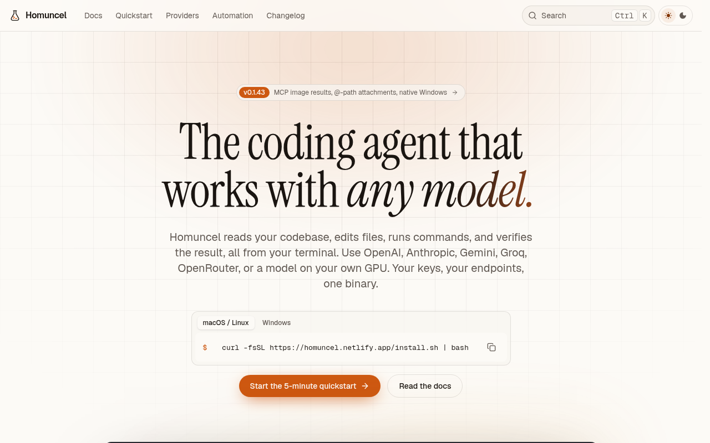

# Homuncel

**The coding agent that works with *any* model.**

[](https://homuncel.netlify.app/)

Homuncel is an **agentic coding tool that runs in your terminal**. Describe what you want in plain language. It gathers context from your repository, edits files, runs commands, and verifies the result. You approve anything risky along the way.

It works like Claude Code and Cursor’s agent, with one important difference: **Homuncel is provider-agnostic.** Point it at OpenAI, OpenRouter, Groq, Gemini, Anthropic, a corporate gateway, or a model on your own GPU through Ollama or vLLM. Your keys and endpoints stay yours.

It ships as a **portable single binary** — no language runtime, package manager, or container required to run the agent. Use the same binary on a laptop, in CI, on a cron, or inside a host product.

**Docs:** [homuncel.netlify.app](https://homuncel.netlify.app/) · [llms.txt](https://homuncel.netlify.app/llms.txt)

## Get started in three commands

```bash
curl -fsSL https://homuncel.netlify.app/install.sh | bash
homuncel credential create --name openai --type bearer --token sk-...
homuncel model create --name gpt --endpoint https://api.openai.com/v1 --model gpt-4.1 --credential openai
cd your-project && homuncel
```

**Windows (PowerShell):** `irm https://homuncel.netlify.app/install.ps1 | iex`

For Auto routing across a strong + light model:

```bash
homuncel model create --name Fast --endpoint https://api.openai.com/v1 --model gpt-4.1-mini --credential openai --tier light
homuncel model edit gpt --tier strong
homuncel model use auto
```

| Next | |
|------|--|
| [Quickstart](https://homuncel.netlify.app/docs/getting-started/quickstart) | Install → first merged fix in about five minutes |
| [Providers](https://homuncel.netlify.app/docs/getting-started/providers) | OpenAI, OpenRouter, Groq, Gemini, Ollama, vLLM, … |
| [Workflows](https://homuncel.netlify.app/docs/getting-started/workflows) | Debug, refactor, review, onboard, UI from screenshots |
| [Headless `run`](https://homuncel.netlify.app/docs/reference/headless) | Automate from CI and host apps |

## What Homuncel does

| | |
|---|---|
| **Builds features and fixes bugs** | Describe the outcome. Homuncel plans, edits with surgical patches, and checks its work with your tests, type checker, and linter. |
| **Understands any codebase** | Searches, reads, and follows definitions instead of guessing — and can research the web when needed. |
| **Delegates to subagents** | Spawns isolated workers for exploration, shell-heavy jobs, or specialists you define in markdown. |
| **Fits into your stack** | MCP, Claude-compatible hooks, skills, and `homuncel run` for CI or your own product. |

## Why teams choose Homuncel

| | |
|---|---|
| **Portable by design** | One static binary (Linux, macOS, Windows). No Node/Go/Docker required to *run* the agent. |
| **Any model, per turn** | Register many endpoints, give each a tier, and let [Auto](https://homuncel.netlify.app/docs/getting-started/models) route light / standard / strong locally — no extra LLM call. |
| **Zero migration** | Reads `CLAUDE.md` / `HOMUNCEL.md`, Claude/Cursor agent files, `SKILL.md` packages, Claude-style hooks, and MCP servers you already use. |
| **You stay in control** | Four [approval modes](https://homuncel.netlify.app/docs/tui/permissions), Plan and Ask, hook vetoes, `/rewind` checkpoints, git [worktrees](https://homuncel.netlify.app/docs/features/checkpoints-worktrees). |
| **Local by default** | Sessions, memory, and config under `~/.homuncel`. Credentials are redacted and kept out of model context. See [Security](https://homuncel.netlify.app/docs/enterprise/security). |
| **Built to embed** | Stable exit codes, a documented [event stream](https://homuncel.netlify.app/docs/reference/headless#event-stream), per-conversation sessions, mid-run follow-ups. Recipes: [CI/CD](https://homuncel.netlify.app/docs/enterprise/ci-cd). |

## The agent loop

**Gather → act → verify**, until the job is done. Every tool call shows up in your scrollback; you can approve, interrupt, or redirect at any point.

```bash
# Interactive
cd your-project && homuncel

# Headless (CI / automation) — one turn, machine-readable output
homuncel run \
  --cwd "$PWD" \
  --approval yolo \
  --stateless \
  --model auto \
  --json \
  --text "Run the unit tests and summarize any failures"
```

## Examples

Starter configs, hooks, headless scripts, and project overlays — [`examples/`](examples/).

| | |
|---|---|
| [`examples/config`](examples/config/) | Ask / Auto / sandbox `config.json` profiles |
| [`examples/hooks`](examples/hooks/) | PreToolUse hook that prefers `rg` over `grep` |
| [`examples/headless`](examples/headless/) | `homuncel run` + `follow-up` for CI |
| [`examples/project`](examples/project/) | `HOMUNCEL.md` + sparse project config |

## Community

| Channel | Use for |
|--------|---------|
| [Discussions](https://github.com/larmoyer/homuncel/discussions) | Q&A, Ideas, Announcements, Show and tell |
| [Issues](https://github.com/larmoyer/homuncel/issues) | Bugs, feature requests, technical problems |
| [Private contact](CONTACT.md) | Confidential topics via GitHub |
| [Docs](https://homuncel.netlify.app/) | Install, providers, TUI, headless `run`, enterprise |

Please read [SUPPORT.md](SUPPORT.md) and [CONTRIBUTING.md](CONTRIBUTING.md) before opening an issue. Security: [SECURITY.md](SECURITY.md).

## License

Free to use for personal and commercial purposes. Redistribution and reverse-engineering of the binary are not permitted. See [LICENSE.md](LICENSE.md).

## Data & privacy

Homuncel runs on your machine against **your** model providers. What leaves your computer depends on the endpoint you configure. Sessions stay under `~/.homuncel`; common secrets are redacted from tool output. Details: [Security](https://homuncel.netlify.app/docs/enterprise/security).
