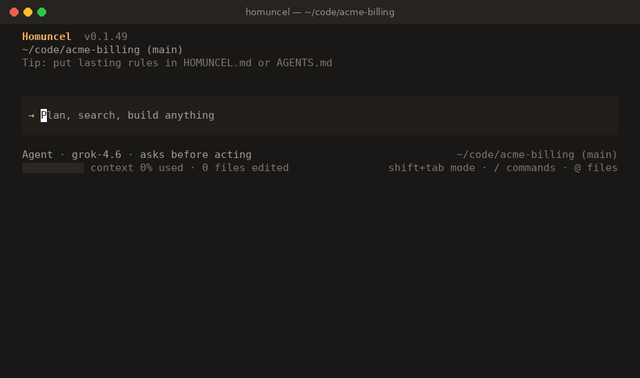

<div align="center">


# Homuncel

### The terminal agent that works with *any* model.

Describe the outcome. Homuncel reads your project, plans, edits, runs your tests, and doesn't stop until the result checks out. On your machine, with your keys.

[](https://github.com/larmoyer/homuncel/releases/latest) [](https://homuncel.netlify.app/docs/getting-started/install) [](https://homuncel.netlify.app/) [](LICENSE.md)

**[Docs](https://homuncel.netlify.app/)** · **[Quickstart](https://homuncel.netlify.app/docs/getting-started/quickstart)** · **[Changelog](https://homuncel.netlify.app/docs/reference/changelog)** · **[Discussions](https://github.com/larmoyer/homuncel/discussions)**

<br/>



<sub>A real session with Homuncel 0.1.49: it runs the failing test, finds the bug, asks before acting, fixes one line, and verifies.</sub>

</div>

---

## Install

```bash
curl -fsSL https://homuncel.netlify.app/install.sh | bash
```

**Windows (PowerShell):** `irm https://homuncel.netlify.app/install.ps1 | iex`

Then open a project and run it:

```bash
cd your-project
homuncel
```

The first run walks you through connecting a model: pick a service, paste a key, and Homuncel checks the connection and sets up a strong and a fast model. Prefer scripting it? See the [Quickstart](https://homuncel.netlify.app/docs/getting-started/quickstart).

Update or roll back any time with `homuncel install`: every release, with its notes, a keystroke away.

## Why Homuncel

<table>
<tr>
<td width="50%" valign="top">

**🔌 Any model, your keys**<br/>
OpenAI, Anthropic, Gemini, xAI, Groq, OpenRouter, NVIDIA, a corporate gateway, or a model on your own GPU through Ollama or vLLM. Mix them: **Auto** routes each request to a light, standard, or strong model, locally, with no extra call.

</td>
<td width="50%" valign="top">

**📦 One portable binary**<br/>
No Node, Python, or Docker needed to run the agent. The same binary works on a laptop, in CI, on a cron, or inside your own product.

</td>
</tr>
<tr>
<td valign="top">

**✅ Finishes the job**<br/>
Homuncel plans with a todo list, works through every part, and checks the result with your tests, builds, and linters. A built-in review compares the result with your request before it calls the task done.

</td>
<td valign="top">

**🛡️ You stay in control**<br/>
Four [approval modes](https://homuncel.netlify.app/docs/tui/permissions), Plan and Ask modes, a sandbox, hooks that can veto any action, and `/rewind` to undo a prompt's edits.

</td>
</tr>
<tr>
<td valign="top">

**🧩 Brings your setup along**<br/>
Reads `AGENTS.md` / `CLAUDE.md`, Agent Skills (`SKILL.md`), Claude-style hooks and subagents, and the MCP servers you already use. Nothing to migrate.

</td>
<td valign="top">

**🔒 Local by default**<br/>
Sessions, memory, and settings live in `~/.homuncel`. Secrets are redacted from tool output and never shown to the model. See [Security](https://homuncel.netlify.app/docs/enterprise/security).

</td>
</tr>
</table>

## What you can hand it

| Task | What Homuncel does |
|---|---|
| **Fix bugs and build features** | "The discount is wrong at exactly $100. Find the bug and fix it." It reproduces, edits with surgical patches, and verifies. |
| **Understand a codebase** | Searches, reads, and follows definitions instead of guessing, and researches the web when it needs to. |
| **Produce documents and data** | Reports, Word and Excel files, slides, and filled templates, rendered and checked page by page against the reference you give it. |
| **Delegate and parallelize** | Subagents for exploration or shell-heavy work, agent teams that coordinate, and specialists you define in Markdown. |
| **Run unattended** | `homuncel run` gives one turn with a JSON result or an event stream, stable exit codes, and follow-ups mid-run. Built for CI and host apps. |

## How it works

**Understand → plan → act → verify**, until the job is done. Skills that match the task load automatically, every tool call appears in your scrollback, and you can approve, interrupt, or redirect at any point.

```bash
# Interactive
cd your-project && homuncel

# Headless (CI / automation): one turn, machine-readable output
homuncel run \
  --cwd "$PWD" \
  --approval auto \
  --stateless \
  --model auto \
  --json \
  --text "Run the unit tests and summarize any failures"
```

| Learn more | |
|---|---|
| [Quickstart](https://homuncel.netlify.app/docs/getting-started/quickstart) | From install to a verified fix in about five minutes |
| [Providers](https://homuncel.netlify.app/docs/getting-started/providers) | OpenAI, Anthropic, Gemini, OpenRouter, Groq, Ollama, vLLM, … |
| [Workflows](https://homuncel.netlify.app/docs/getting-started/workflows) | Debug, refactor, review, onboard, build UI from screenshots |
| [Headless `run`](https://homuncel.netlify.app/docs/reference/headless) | Automate from CI and host apps |
| [`llms.txt`](https://homuncel.netlify.app/llms.txt) | The docs, ready for your own agents |

## Examples

Starter configs, hooks, headless scripts, and project overlays live in [`examples/`](examples/).

| Folder | What's inside |
|---|---|
| [`examples/config`](examples/config/) | Ask / Auto / sandbox `config.json` profiles |
| [`examples/hooks`](examples/hooks/) | A PreToolUse hook that prefers `rg` over `grep` |
| [`examples/headless`](examples/headless/) | `homuncel run` and mid-run follow-ups for CI |
| [`examples/project`](examples/project/) | `HOMUNCEL.md` and a sparse project config |

## Community

| Channel | Use it for |
|---|---|
| [Discussions](https://github.com/larmoyer/homuncel/discussions) | Questions, ideas, announcements, show and tell |
| [Issues](https://github.com/larmoyer/homuncel/issues) | Bugs, feature requests, technical problems |
| `/bug` · `/feedback` | Email the team from inside Homuncel, with your version and OS filled in |
| [Private contact](CONTACT.md) | Confidential topics through GitHub |

Please read [SUPPORT.md](SUPPORT.md) and [CONTRIBUTING.md](CONTRIBUTING.md) before opening an issue. Security reports: [SECURITY.md](SECURITY.md).

## License and privacy

Homuncel is **free to use** for personal and commercial purposes. Redistribution and reverse-engineering of the binary are not permitted. See [LICENSE.md](LICENSE.md).

Homuncel runs on your machine against **your** model providers: what leaves your computer depends on the endpoint you configure. Details: [Security](https://homuncel.netlify.app/docs/enterprise/security).

<div align="center">
<br/>
<sub>Built for people who want an agent they can point at any model, and trust with real work.</sub>
</div>
